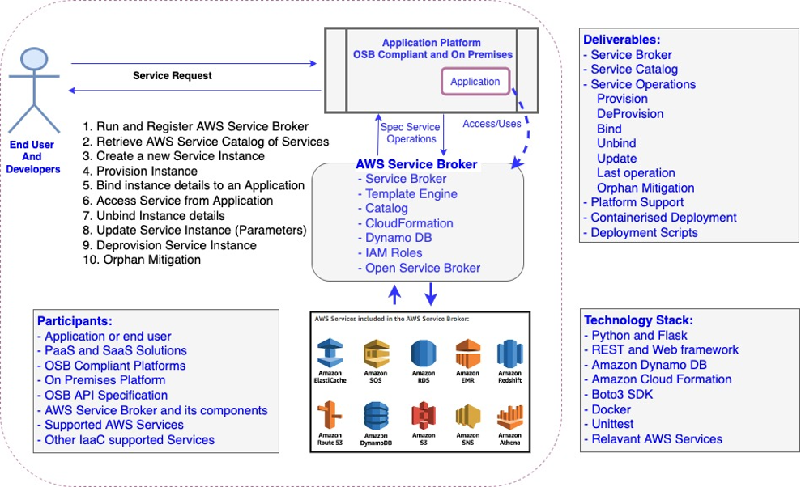

# AWS Service Broker 1.0 - A Python implementation of Open Service Broker API specification 

This solution is an open-source project which allows native AWS services to be exposed directly to the end users, applications hosted on-premises and to third party application platforms. It provides easy and standard way to avail AWS services directly within the application platform. 

This is built around Service Brokers, Open Service Broker API specification, AWS Service broker and application platforms.

Service brokers are the missing link between the consumer/solution platform and the service providers. These brokers hold all information about the categories of services provided and take care of provisioning of these services to the application being used by consumer. This can automate steps that are often used to avail services from multiple Service providers and with multiple infrastructure management tools. Service Brokers are responsible for advertising a catalog of Service Offerings and Service Plans to the Platform, and acting on requests from the Platform for provisioning, binding, unbinding, and deprovisioning.

The Open Service Broker API specification defines an HTTP(S) interface between platforms and service brokers. The OSB API specifies how automated deployment, management, and use of services is handled. For example, app developers can use it to instantiate services and attach them to apps without having to care about how those services are ultimately created or managed. The standardization offered by the Open Service Broker API specification is set to spur innovation and the pace of advancements in the industry. Cloud service providers are now capable of reaching wider developer communities with their services, while businesses are able to apply greater focus to developing core applications and attending to their users’ needs.

The AWS Service Broker open-source project, which allows developers and end-users using OSB compliant as well as on-premises application platforms to provision and expose native AWS services from within application platform interfaces. The AWS Service Broker uses AWS CloudFormation infrastructure-as-code templates to provision resources used within application platforms. It works as easy way to or bridge between customer/end users and AWS services.

Application platform include OSB compliant platforms such as Kubernetes, OpenShift, CloudFoundary and on premises.

## WHAT PROBLEM IT SOLVES:

Choosing from specific cloud platform, it services(s), service parameters make the development life cycle and the management life cycle tougher. If it is a multi-cloud environment or hybrid cloud service model, it makes the task more complex to be adopted, especially by an enterprise. The AWS Service broker implementation of Open Service Broker API specification shall make the AWS service availability easier with API end points catering to service request.

The usage of these standard APIs enables the creation of marketplaces offered by application platforms which can also include services from cloud providers such as AWS. They are a central place where you register Brokers (AWS Service Broker) and then the solution platform will provide the user with a combined catalog of all available services. Now these services can be created or used with few calls to API end points defined by the Broker.

## HOW IT SOLVES THE PROBLEM:

AWS Service broker implementation of OSB API specification solves the problem by standard API end points which client can call to avail cloud services.

AWS has 100s for services for customer to use. Customers are having brokers for every AWS resource like Amazon S3, Amazon RDS, Amazon DynamoDB and many more. Problem with having brokers for every AWS service is maintaining multiple codebases which can be cumbersome and new feature added requires code changes in the broker. So instead of having service broker for each AWS resources we can have a generic broker which can take CloudFormation as input and provision the AWS resources accordingly. CloudFormation can be constructed from the client and sent to service broker which eliminates having multiple brokers. CloudFormation helps to provision AWS service asynchronously and the exported stack output can be returned to the client in bind operation.  Customers will have flexibility to generate service catalog at client side rather than server side.

## Architectural Components:



*   [Illustrates component flow of the platforms and various actors.]   *

## Installation

* [Prerequisites](/docs/install_prereqs.md)
* [Installation on on-Premises](/docs/getting-started-onpremised.md)
* [Installation on OpenShift](/docs/getting-started-openshift.md)
* [Installation on Pivotal Cloud Foundry](/docs/getting-started-pcf.md)
* [Installation on Kubernetes](/docs/getting-started-k8s.md)
* [Installation on SAP Cloud Platform](/docs/getting-started-scp.md)

## Service Operations - Provisioning , Update and binding services

Documentation for all of the available plans, their parameters and binding outputs are available in the
[AWS Service Broker GitHub repository](https://gitlab.aws.dev/osbapi/aws-open-service-broker-1.0/-/tree/main/template-engine/src/config/templates)

## Client Code Example

```
import requests
r = requests.get('http://127.0.0.1:5000/v2/catalog')
print(r)
print(r.content)
```

## Template Metadata Generator

A tool that examines the parameters of the JSON Cloudformation template and automatically creates the Service Broker Metadata (AWS::ServiceBroker::Specification) for the template and outputs in JSON and YAML format. It will include all parameters in the template into the metadata.

https://github.com/ndrest-amzn/ServiceBrokerMetaGen

## Template Documentation Generator

A tool tha automatically creates the Service Broker doc Readme.md from the Cloudformation Template provided. It will include all parameters in the template into the Readme.md.

https://github.com/ndrest-amzn/ServiceBrokerDocGen
